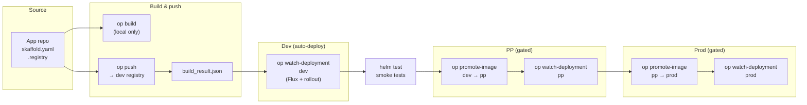
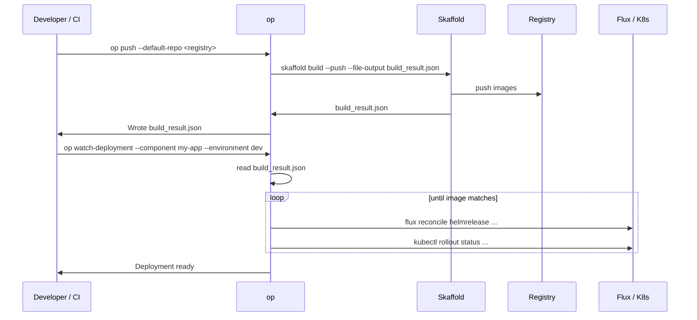
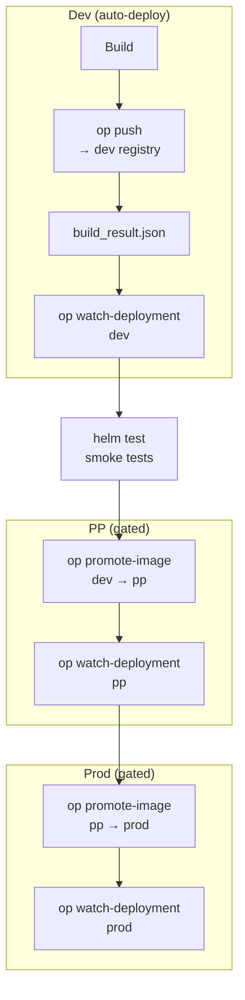

# Building your own workflow with OctoPilot Pipeline Tools

This doc shows how to compose a **build → push → deploy / promote** workflow using **`op`** (or **`octopipeline`**). Your app repo needs a **Skaffold + Buildpacks** setup (e.g. [octopilot-samples](https://github.com/octopilot/octopilot-samples)); **op** provides the glue and the **build_result.json** artifact that ties build output to Flux and promotion.

A separate **OctoPilot workflows** repo will be added later with reusable workflow definitions and examples (e.g. GitHub Actions, Tekton). Use this document to design your own flow until then.

---

## High-level flow

- **op build** — Skaffold build only (no push); useful for local checks.
- **op push** — Skaffold build with `--push` to the **dev** registry, writes **build_result.json** (image refs for CD).
- **Dev (auto-deploy)** — After push, **op watch-deployment** runs in the same pipeline so **dev** is deployed automatically (no gate).
- **PP (gated)** — After **helm test smoke tests** pass, run **op promote-image** (dev → pp) and **op watch-deployment** for PP.
- **Prod (gated)** — After PP is deployed, run **op promote-image** (pp → prod) and **op watch-deployment** for prod (you can add a second gate before prod if needed).
- **op watch-deployment** — Uses **build_result.json**; reconciles the Flux HelmRelease and waits for rollout in the **same** environment.
- **op promote-image** — Uses **build_result.json**; copies the image from one env registry to another (e.g. dev → pp → prod).

---

## Single-environment workflow

One registry, one cluster: build, push, then watch until the deployment matches the new image.

**Typical steps:**

1. **Build and push** (CI or local):
   `op push` (registry from `--default-repo`, env, or `.registry`).
2. **Wait for deploy** (same job or a follow-up step):
   `op watch-deployment --component <name> --environment dev`
   (Config: `pipeline.properties` or env for `WATCH_DESTINATION_REPOSITORY` / `GOOGLE_GKE_IMAGE_REPOSITORY`.)

---

## Multi-environment workflow (dev → pp → prod)

Build once in **dev**; **dev** is **auto-deployed** (no gate). Promotion to **PP** and **prod** is **gated by helm test smoke tests**; after the gate passes, use **op promote-image** and **op watch-deployment** for each environment.

- **Dev (auto-deploy):** `op push` → images in dev registry; `op watch-deployment --environment dev` runs in the same pipeline so dev cluster gets the new tag with no gate.
- **Gate:** Before promoting to PP or prod, run **helm test** smoke tests (e.g. against dev or a staging release). Only after they pass do you promote.
- **Promote to PP:** `op promote-image --source dev --destination pp` (reads tag from **build_result.json**; config from `pipeline.properties` or env, e.g. `GOOGLE_GKE_IMAGE_REPOSITORY`, `GOOGLE_GKE_IMAGE_PP_REPOSITORY`), then `op watch-deployment --environment pp`.
- **Promote to prod:** `op promote-image --source pp --destination prod`, then `op watch-deployment --environment prod` (you can add a second gate or approval between pp and prod if needed).

You can run **op** in CI (e.g. one job per env or one pipeline with stages). The important contract is **build_result.json** produced by **op push** and consumed by **op watch-deployment** and **op promote-image**.

---

## Clusters and namespaces: your choice

How you map **dev**, **pp**, and **prod** to Kubernetes is up to you. **op** does not assume a specific layout; it only needs a registry per environment and (for **watch-deployment**) a Flux HelmRelease to reconcile and a rollout to wait on.

**Two common patterns:**

- **Different cluster per environment** — e.g. one cluster for dev, one for pp, one for prod. Each environment has its own Flux and its own registry (or registry path). You run **op** with kubeconfig or context pointing at the right cluster for each step.
- **Same cluster, different namespaces** — e.g. one cluster with namespaces `dev`, `pp`, `prod`. Flux and HelmReleases are scoped per namespace; you run **op watch-deployment** with the appropriate namespace/context for each environment.

You choose how to structure Flux (Kustomization, HelmRelease, GitRepository, etc.) and where each environment runs. A separate **OctoPilot workflows** repo will provide example layouts for these and other scenarios; we will link to the relevant example from this doc for each case (e.g. [multi-cluster dev/pp/prod](…), [single-cluster multi-namespace](…)) once that repo is available.

---

## Where to run **op**

| Context | How |
|--------|-----|
| **Local** | `pip install -e .` in this repo, then run `op` from your app repo (or use the container with the repo mounted). |
| **Docker** | Use the **octopipeline** image; mount your app repo and (if building) the Docker socket; pass `op push`, `op watch-deployment`, etc. See [README](README.md#docker-no-install-includes-skaffold-flux-kubectl-crane). |
| **GitHub Actions** | Run the **octopipeline** container as a step; set `--default-repo` or `.registry` and env (e.g. `GITHUB_REPOSITORY_OWNER`). |
| **Other CI** | Same idea: run the container or install the CLI, then invoke **op** with the right registry and config. |

Config (registries, env-specific repos) can come from **.registry**, **pipeline.properties**, or env vars; see [README – Config](README.md#config-properties-file).

---

## Reusable workflows and Flux examples (later)

A separate **OctoPilot workflows** repo is planned. It will provide:

- Example workflow definitions (e.g. GitHub Actions composite actions or workflows, Tekton pipelines).
- Reusable patterns for build → push → watch and build → promote → watch across dev / pp / prod.
- **Flux layout examples** for different topologies (e.g. one cluster per environment vs one cluster with multiple namespaces). We will link to the relevant scenario from this doc each time (e.g. multi-cluster dev/pp/prod, single-cluster multi-namespace).

Until then, use this document and the [README](README.md) to wire **op** into your own pipelines. The four commands (**build**, **push**, **watch-deployment**, **promote-image**) and **build_result.json** are the only contract you need.
